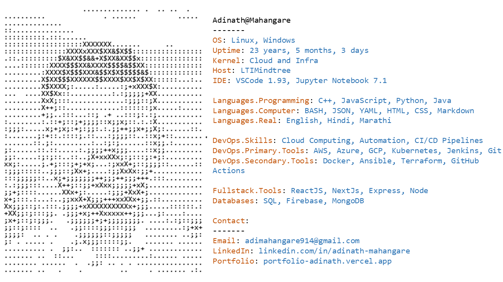

<!--MasterHead-->

<a href="https://github.com/adinathmahangare/adinathmahangare">
  <picture>
    <source media="(prefers-color-scheme: dark)" srcset="Slide2.PNG">
    
  </picture>
</a>

<h3 align="center"> ☁️ DevOps Engineer | 🔒 MERN Developer | 🚀 Machine Learning Enthusiast </h3>

Eager to learn and embrace emerging technologies to build efficient and impactful solutions.

  
<!--

-->

<!--📏LINE-->

## snake eating my contribution graph

  

<!--📏LINE-->

<!--Languages and Tools-->
<h3 align="left">Languages and Tools</h3>

 

  

<!--📏LINE-->

<!--Connect with me-->

